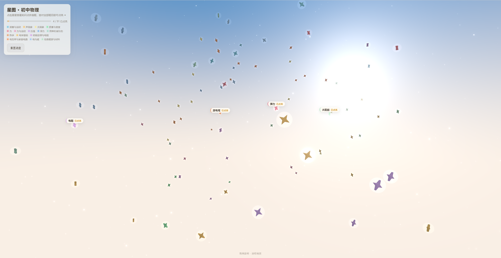
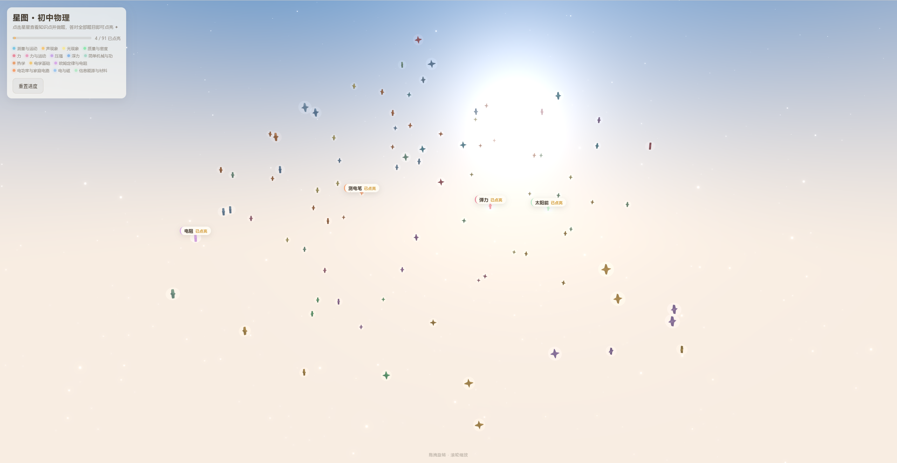
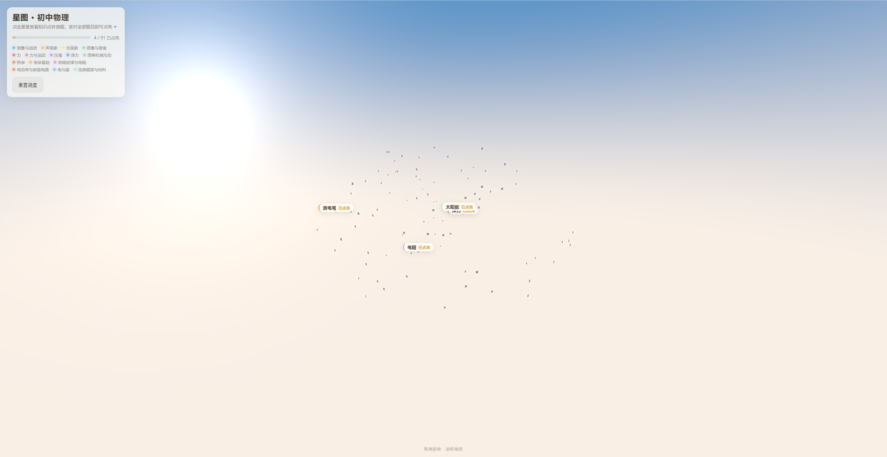
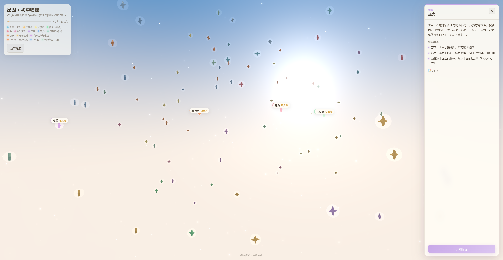
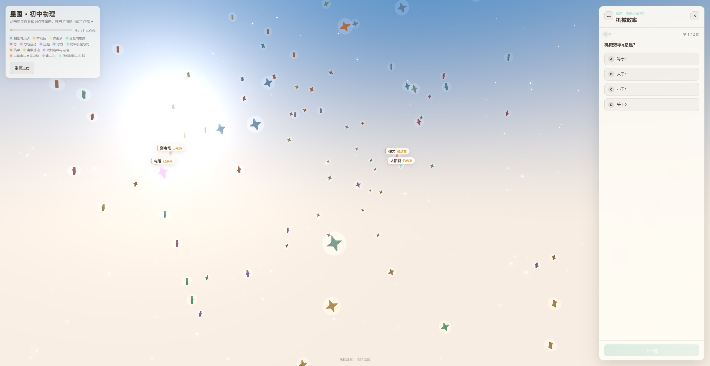

# 星途 · 星图（Xingtu）

> 初中物理知识星图 — 在吉卜力风格的白昼天穹下，点亮每一颗知识之星 ✨

   

## 项目简介

**星途** 是一个 3D 交互式学习页面，将初中物理全部 **15 个章节、91 个知识点**化作漫天星辰，随机散布在吉卜力风格的白昼天穹中。每颗星代表一个知识点，点击可查看详情并答题；全部答对即点亮该星，发出柔和的光芒。

🌟 **核心体验**：浏览星图 → 点击星星 → 阅读知识 → 完成测验 → 点亮星辰

> ⚠️ 本项目仍在**快速迭代**中，功能、数据结构、视觉表现均可能随时变动。

---

## 功能概览

| 功能 | 说明 |
|------|------|
| 🌌 3D 星图 | 91 颗知识星随机散布在球壳空间中，15 种柔和色彩对应 15 个章节 |
| ☁️ 吉卜力天空 | 渐变天穹 + 程序化云层 + 柔和日光，打造梦幻白昼氛围 |
| 📖 知识面板 | 点击星星查看知识点摘要与核心要点 |
| 📝 随堂测验 | 每个知识点 2–3 道选择题，附带详细解析 |
| ✨ 点亮机制 | 全部答对即点亮星星，产生辉光闪烁效果 |
| 💾 进度持久化 | 学习进度保存在浏览器 `localStorage`，刷新不丢失 |
| 🖱️ 自由视角 | 拖拽旋转、滚轮缩放，可从全局概览深入星群之间 |

## 效果展示









---

## 快速开始

### 环境要求

- **Node.js** ≥ 18
- **pnpm**（推荐）或 npm

### 安装与运行

```bash
# 克隆仓库
git clone <repo-url>
cd xingtu-frontend

# 安装依赖
pnpm install

# 启动开发服务器
pnpm dev
# 打开 http://localhost:5173

# 类型检查（dev 模式下不会检查类型，需要手动运行）
pnpm exec tsc --noEmit

# 构建生产版本
pnpm build

# 预览生产构建
pnpm preview
```

> ⚠️ 本项目需要 WebGL 支持。在无头浏览器中运行需添加参数：
> `--enable-unsafe-swiftshader --use-gl=angle --use-angle=swiftshader-webgl`

---

## 知识点与题目配置

### 数据来源

所有知识点数据存储在 **`public/data/knowledge-points.json`**，这是唯一的运行时数据源。修改此文件并刷新页面即可生效，无需重新构建。

### 数据结构

JSON 文件包含两个顶层字段：

```jsonc
{
  // 15 个章节定义，每章分配一种柔和色彩
  "chapters": [
    { "name": "测量与运动", "color": "#7EC8E3" },
    { "name": "声现象", "color": "#F5C878" }
    // ...
  ],

  // 91 个知识点，每个包含摘要、要点和测验题
  "knowledgePoints": [
    {
      "id": "length-measure",          // 唯一标识符
      "title": "长度测量",              // 显示名称
      "chapter": "测量与运动",           // 所属章节（对应 chapters[].name）
      "order": 0,                      // 排序权重（也用作随机位置的种子）
      "summary": "刻度尺是测量长度的基本工具...", // 概要说明
      "keyPoints": [                   // 3–4 条核心要点
        "国际单位：米(m)；常用单位：km、dm、cm、mm、μm、nm",
        "使用前认清量程、分度值、零刻度线",
        "读数估读到分度值的下一位，记录带单位",
        "误差不可避免，多次测量求平均值可减小误差"
      ],
      "questions": [                    // 2–3 道选择题
        {
          "id": "q1",
          "text": "用分度值为1mm的刻度尺测量长度，读数应估读到？",
          "options": ["1mm", "0.1mm", "1cm", "0.1cm"],
          "answer": 1,                  // 正确选项的下标（从 0 开始）
          "explanation": "估读到分度值的下一位，1mm的下一位是0.1mm。"
        }
      ]
    }
  ]
}
```

### 各章节知识点数量

| 章节 | 知识点数 | 题目数 |
|------|---------|--------|
| 测量与运动 | 5 | 10 |
| 声现象 | 7 | 14 |
| 光现象 | 10 | 20 |
| 质量与密度 | 4 | 8 |
| 力 | 5 | 10 |
| 力与运动 | 4 | 8 |
| 压强 | 5 | 10 |
| 浮力 | 5 | 10 |
| 简单机械与功 | 5 | 10 |
| 热学 | 10 | 20 |
| 电学基础 | 5 | 10 |
| 欧姆定律与电阻 | 5 | 10 |
| 电功率与家庭电路 | 8 | 16 |
| 电与磁 | 7 | 14 |
| 信息能源与材料 | 6 | 12 |
| **合计** | **91** | **195** |

### 批量编辑知识点

知识点的原始大纲记录在 `public/all_knowledge.md`，按章节以表格形式组织，可作为编辑参考。

### 自定义数据源

默认从 `/data/knowledge-points.json` 加载数据。可通过环境变量覆盖：

```bash
VITE_DATA_URL=https://example.com/my-data.json pnpm dev
```

### 添加/修改知识点的步骤

1. **单点修改**：直接编辑 `public/data/knowledge-points.json`，刷新页面即可
2. **批量修改**：先在 `public/all_knowledge.md` 中规划大纲，再据此修改 JSON
3. 每个知识点至少包含 **2 道题目**，建议 2–3 道
4. `chapter` 字段必须与 `chapters` 数组中的 `name` 完全一致
5. `answer` 是选项数组的下标（从 0 开始）

---

## 技术架构

```
xingtu-frontend/
├── public/
│   ├── all_knowledge.md              # 知识点大纲源文件
│   └── data/
│       └── knowledge-points.json     # 运行时知识点数据（唯一数据源）
├── src/
│   ├── App.tsx                       # 主应用：状态管理与 UI 组装
│   ├── main.tsx                      # 入口
│   ├── data/
│   │   ├── DataProvider.tsx          # React Context，fetch JSON 并提供数据
│   │   ├── types.ts                  # 类型定义
│   │   └── knowledgePoints.ts        # 类型重导出
│   ├── state/
│   │   └── useProgress.ts           # Zustand 进度存储（localStorage 持久化）
│   ├── three/
│   │   ├── Scene.tsx                 # R3F 画布、灯光、后处理（Bloom）
│   │   ├── StarsSpiral.tsx           # 星星容器组件
│   │   ├── KnowledgeStar.tsx        # 单颗星：4角光芒几何体 + 交互
│   │   ├── GalaxyBackground.tsx      # 天空背景容器
│   │   ├── SkyDome.tsx               # 天穹着色器（渐变 + 日光）
│   │   ├── GhibliClouds.tsx          # 吉卜力风格程序化云层
│   │   ├── Stardust.tsx              # 星尘粒子系统
│   │   ├── spiral.ts                 # 随机球壳位置生成器
│   │   └── SpiralPath.tsx            # （已弃用，未挂载）
│   └── ui/
│       ├── Hud.tsx                   # HUD：进度统计 + 图例
│       ├── KnowledgePanel.tsx        # 知识详情面板
│       └── QuizPanel.tsx             # 答题面板
├── package.json
├── tsconfig.json
└── vite.config.ts
```

### 技术栈

| 技术 | 用途 |
|------|------|
| [React 19](https://react.dev) | UI 框架 |
| [Three.js 0.184](https://threejs.org) | 3D 渲染引擎 |
| [React Three Fiber 9](https://docs.pmnd.rs/react-three-fiber) | React Three.js 绑定 |
| [Drei](https://github.com/pmndrs/drei) | R3F 辅助工具库 |
| [React Three Postprocessing](https://github.com/pmndrs/react-postprocessing) | 后处理效果（Bloom 辉光） |
| [Zustand 5](https://zustand.docs.pmnd.rs) | 状态管理（进度持久化） |
| [Vite 8](https://vite.dev) | 构建工具 |
| [TypeScript 6](https://www.typescriptlang.org) | 类型安全 |

### 四层架构

1. **数据层** (`src/data/`) — 从 JSON 加载知识点数据，通过 React Context 分发
2. **状态层** (`src/state/`) — Zustand 管理答题进度，`localStorage` 持久化
3. **3D 场景层** (`src/three/`) — R3F 画布、星星几何体、天空着色器、后处理
4. **UI 覆盖层** (`src/ui/`) — 纯 DOM 面板（知识详情、答题、HUD），绝对定位叠加在 Canvas 上

### 点亮与辉光机制

星星的点亮效果基于**选择性 Bloom（Selective Bloom）**技术：

- 场景启用 ACES 色调映射，但星星材质设置 `toneMapped={false}` 使其发射光绕过色调压缩
- **未点亮**：`emissiveIntensity ≈ 0.42`，颜色值低于阈值，不产生辉光
- **已点亮**：`emissiveIntensity ≈ 1.2`，颜色值超过亮度阈值 1，触发 Bloom 辉光
- **闪烁动画**：点亮瞬间通过 `useFrame` 将 `emissiveIntensity` 短暂提升至 ~6，产生一次性闪光

---

## 已知问题

- 开发服务器控制台会输出 `THREE.Clock deprecated, use THREE.Timer` 警告——来自 R3F 内部，不影响功能
- 本项目为手动搭建（非 `create-vite` 生成），暂无 `.gitignore`

---

## 许可证

本项目仅供学习交流使用。
